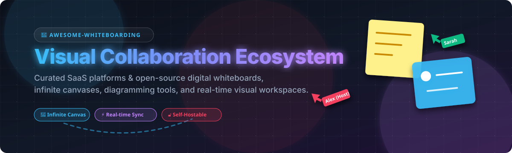

# 🎨 Awesome Whiteboarding Ecosystem 🚀

   

**Curated List of SaaS Commercial Whiteboard Products & Open-Source GitHub Projects**  
*Focused on Collaborative Digital Whiteboards, Infinite Canvas, Brainstorming, Visual Workspace, Diagramming & Interactive Ideation Tools*  

**Last updated: August 2026** 📅

---

## 🌟 Overview & Features

This repository tracks top-tier **SaaS platforms** and **open-source projects** for **digital whiteboarding** and **visual collaboration**. Whether you need an infinite canvas for real-time remote team workshops, interactive brainstorming sticky notes, technical architecture diagramming, or self-hosted privacy-focused canvas tools, this list covers the best visual workspace software available.

- 🏢 **Enterprise SaaS Solutions**: Miro, FigJam, Mural, Lucidspark, Microsoft Whiteboard, and Whimsical.
- 🔓 **Privacy & Open-Source Tools**: Self-hostable, local-first, end-to-end encrypted whiteboards such as Excalidraw, AFFiNE, draw.io, tldraw, Penpot, and Rnote.

---

## 📑 Table of Contents

- [🏢 SaaS & Hosted Commercial Platforms](#-saas--hosted-commercial-platforms)
- [🔓 Open-Source GitHub Projects](#-open-source-github-projects)
- [🛠️ Frameworks & Libraries for Custom Whiteboards](#%EF%B8%8F-frameworks--libraries-for-custom-whiteboards)
- [🤝 How to Contribute](#-how-to-contribute)
- [📜 Disclaimer](#-disclaimer)
- [⭐ Star History](#--star-history)

---

## 🏢 SaaS & Hosted Commercial Platforms

Below is the comparative overview of commercial visual whiteboarding SaaS tools, **sorted by Company Size / Market Valuation (Descending)** 📉.

| Product | Description | Starting Price | Free Tier Limit | Company Size / Valuation |
| :--- | :--- | :--- | :--- | :--- |
| 📊 **[Miro](https://miro.com/)** | Enterprise visual workspace platform with rich template ecosystem, facilitation controls, and deep app integrations. | $8/member/month (annual) or $10/member/month (monthly) | 3 editable boards, 10 AI credits/month, unlimited team members | **$17.5 Billion** valuation (~$665M ARR) |
| 🎨 **[FigJam](https://www.figma.com/figjam/)** | Figma's lightweight, interactive whiteboarding tool for design workshops, team ideation, and live collaboration. | $3/member/month (Collab seat annual) | 3 FigJam files per team, unlimited personal drafts, 30-day version history | **~$14.9 Billion** market cap (~$1.46B ARR) |
| 💡 **[Lucidspark](https://lucidspark.com/)** | Virtual whiteboard by Lucid for visual brainstorming, card sorting, note clustering, and technical diagramming. | $9/month (Individual annual) | 3 editable boards, 60 objects per board limit | **$3.0 Billion** valuation (~$145M ARR) |
| 🧩 **[Mural](https://www.mural.co/)** | Guided visual collaboration workspace tailored for enterprise design thinking, agile planning, and structured workshops. | $9.99/member/month (annual) or $12/member/month (monthly) | 3 editable murals, 1 workspace, open room access only | **$2.0 Billion** valuation (~$189M ARR) |
| 🟩 **[Microsoft Whiteboard](https://www.microsoft.com/en-us/microsoft-365/microsoft-whiteboard)** | Freeform digital canvas tightly integrated into Microsoft 365, Teams meetings, and office suites. | Included with Microsoft 365 (or Free standalone) | Free forever with personal Microsoft account (unlimited whiteboards) | **Included in M365** ($3.3 Trillion Microsoft parent) |
| 📝 **[Whimsical](https://whimsical.com/)** | Fast visual workspace integrating flowcharts, wireframes, mind maps, documents, and sticky note whiteboards. | $10/editor/month (annual) or $12/editor/month (monthly) | 3 team boards, 100 lifetime AI actions, 10 view-only guests | **Series A Funded** (Multi-million ARR) |
| ⚡ **[Stormboard](https://stormboard.com/)** | Agile digital whiteboard featuring automated sticky note reporting, line items, and structured meeting templates. | $8.33/user/month (annual) or $10/user/month (monthly) | 5 open Storms (boards), up to 5 collaborators per Storm | **~$10.0 Million** ARR (Bootstrapped) |
| 🔒 **[Conceptboard](https://conceptboard.com/)** | Secure European cloud visual whiteboard designed for remote team collaboration, board auditing, and review. | €5/user/month (Starter plan) | 100 objects per board limit, 250 MB storage limit | **~$1.6 Million** ARR |
| 🇪🇺 **[Collaboard](https://www.collaboard.app/)** | Data-compliant European online whiteboard offering guest editing, infinite canvas, and on-premises hosting options. | €5/user/month (Basic plan) | 3 whiteboards, up to 5 participants per board | **~$1.2 Million** ARR |
| opacity="0.8" 🖊️ **[Excalidraw+](https://plus.excalidraw.com/)** | Managed cloud collaboration platform built on top of the open-source Excalidraw hand-drawn sketch editor. | $6/user/month (annual) or $7/user/month (monthly) | 14-day free trial (Excalidraw web editor is free & local) | **~$0.9 Million** ARR (Bootstrapped) |

---

## 🔓 Open-Source GitHub Projects

The following list contains top open-source virtual whiteboard repos, **sorted by GitHub Star Count (Descending)** ⭐.

- ✏️ **[Excalidraw](https://github.com/excalidraw/excalidraw)**   
  The leading open-source virtual whiteboard (MIT License). Hand-drawn sketch style diagrams, wireframes, end-to-end encrypted live multiplayer collaboration, offline local storage, and easy embedding.

- 📑 **[AFFiNE](https://github.com/toeverything/AFFiNE)**   
  Local-first, privacy-focused open-source workspace (MIT License) that seamlessly fuses infinite canvas whiteboarding, structured markdown documents, and multi-dimensional databases.

- 📐 **[diagrams.net / draw.io](https://github.com/jgraph/drawio)**   
  Feature-packed open-source diagramming application (Apache 2.0) widely used for technical flowcharts, network architecture diagrams, process maps, and infinite canvas sketching. Fully self-hostable.

- 🎨 **[Penpot](https://github.com/penpot/penpot)**   
  Open-source web-based design and prototyping tool (MPL 2.0) built natively on open web standards (SVG). Offers canvas capabilities suitable for collaborative visual design, wireframing, and whiteboarding.

- 🎯 **[tldraw](https://github.com/tldraw/tldraw)**   
  High-performance infinite canvas drawing library and whiteboard SDK. Features smooth vector drawing, sticky notes, multiplayer state management, and custom shape primitives.

- 🗺️ **[Drawnix](https://github.com/plait-board/drawnix)**   
  All-in-one open-source whiteboard tool supporting interactive mind maps, flowcharts, freehand sketching, and architectural layouts on an infinite canvas.

- 🖋️ **[Rnote](https://github.com/flxzt/rnote)**   
  Vector-based open-source handwritten note-taking and drawing application (GPL 3.0) designed for stylus pens, touch devices, and infinite canvas sketching.

- 🕹️ **[Lorien](https://github.com/mbrlabs/Lorien)**   
  Cross-platform infinite canvas drawing and whiteboarding tool built with the Godot engine. Uses performant vector stroke rendering for fast note-taking and sketching.

- 🍃 **[LeaferUI](https://github.com/leaferjs/leafer-ui)**   
  Ultra-fast open-source 2D HTML5 canvas engine specifically optimized for building interactive infinite canvas applications, digital whiteboards, and visual tools.

- 🎓 **[OpenBoard](https://github.com/OpenBoard-org/OpenBoard)**   
  Cross-platform open-source interactive classroom whiteboard application (GPL 3.0) intended for educators, dual-screen presentations, document annotation, and teaching.

- 🌐 **[WBO / Whiteboard Online](https://github.com/lovasoa/whitebophir)**   
  Lightweight web-based open-source collaborative whiteboard (AGPL 3.0) for real-time multi-user drawing directly in browser windows with minimal server overhead.

- ⚙️ **[Drafft.ink](https://github.com/PatWie/drafft-ink)**   
  High-performance open-source infinite canvas whiteboard built using Rust and WebGPU, delivering hardware-accelerated live multiplayer sketching.

---

## 🛠️ Frameworks & Libraries for Custom Whiteboards

If you are building your own custom whiteboard application or embedding an infinite canvas:

1. ✏️ **Excalidraw Package**: Embed `excalidraw` as a React component for instant hand-drawn diagrams and collaboration support.
2. 📐 **Draw.io Embedding**: Use the `draw.io` iframe/editor integration when precise engineering or flowcharting capabilities are needed.
3. 📑 **AFFiNE Engine**: Excellent choice for combining document editing with infinite canvas whiteboards in local-first apps.
4. 🎯 **tldraw Canvas Engine**: Use `tldraw` SDK for flexible React-based custom canvas primitives, shape rendering, and state management.

---

## 🤝 How to Contribute

Contributions are welcome! Please follow these simple steps:

1. 🍴 Fork this repository.
2. ➕ Add or update entries in `README.md` maintaining proper alphabetical or metric sort order.
3. 📝 Include official links, star badges, factual descriptions, and accurate metrics.
4. 🚀 Open a Pull Request with a short summary of changes.

---

## 📜 Disclaimer

- This list is **community-curated** for educational and decision-making purposes.
- Self-hosted open-source tools offer privacy and full control over data, while SaaS options provide hosted multiplayer infrastructure, enterprise admin features, and pre-made templates out-of-the-box.
- Always verify current licensing terms (especially for embedded libraries) before commercial deployment.

---

##  Star History

<a href="https://www.star-history.com/?repos=ishandutta2007%2FAwesome-Whiteboarding&type=date&legend=bottom-right">
<picture>
<source media="(prefers-color-scheme: dark)" srcset="https://api.star-history.com/chart?repos=ishandutta2007/Awesome-Whiteboarding&type=date&theme=dark&legend=bottom-right" />
<source media="(prefers-color-scheme: light)" srcset="https://api.star-history.com/chart?repos=ishandutta2007/Awesome-Whiteboarding&type=date&legend=bottom-right" />

</picture>
</a>

---

**Made with ❤️ for product managers, software engineers, facilitators, educators, and visual thinkers.**
